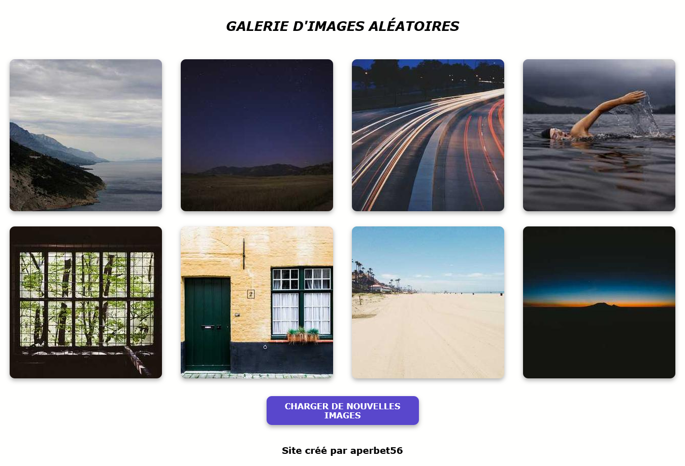

## GALERIE D'IMAGES ALEATOIRES

## Le challenge

Création d'une galerie d'images aléatoires avec la possibilité de faire apparaître des images supplémentaires en cliquant sur le bouton "charger de nouvelles images".

## Démonstration

Lien vers le projet : https://aperbet56.github.io/galerie_images_aleatoire/

## Projet développé avec

- Utilisation des balises sémantiques HTML5
- CSS3
- Flexbox
- Animation CSS au survol des images et du bouton
- Page web responsive
- Utilisation d'un normaliseur : normalize.css
- Desktop first
- picsum photos
- JavaScript
- Code JavaScript commenté
